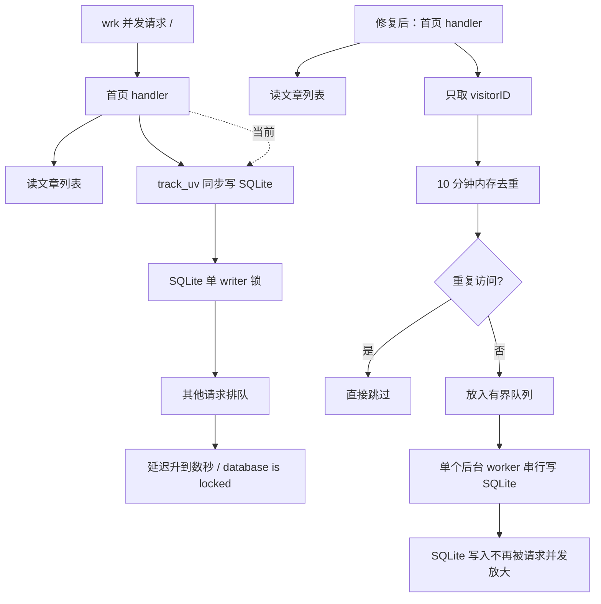

## oracle 免费实例：VM.Standard.E2.1.Micro

* CPU：1 个 OCPU
* 内存：1 GB
* 网络带宽：0.48 Gbps（约 480 Mbps）
* 引导卷（Boot Volume）：默认 50 GB，使用块存储 

## 首页 UV 写入性能诊断

当使用 `wrk` 对首页做高并发压测时，默认不会保留服务端下发的 `vid` cookie。这样每个请求都像新访客，会放大 UV 写入压力；即使固定 `vid`，同步 UV upsert 也会让请求等待 SQLite 写锁。

诊断时可打开轻量性能日志：

```bash
SWAVES_PERF_TRACE=1 SWAVES_PERF_TRACE_MIN_MS=50 /path/to/swaves data.sqlite
```

关注日志中的 `site.track_uv`、`db.list_published_posts`、`site.home`。如果看到 `site.track_uv` 秒级耗时或 `database is locked`，瓶颈在 UV 写入和 SQLite 写锁竞争。


